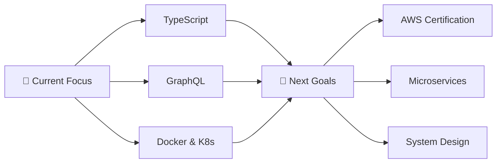

<div align="center">

<!-- Animated Typing Header -->


<!-- Wave Animation -->


</div>

---

<div align="center">

### 🎯 Full-Stack Developer | 💻 JavaScript Enthusiast | 🌱 Continuous Learner

[](https://github.com/rabbitkg)
[](https://github.com/rabbitkg)
[](https://github.com/rabbitkg)

</div>

---

## 🚀 About Me

```javascript
const rabbitkg = {
    location: "🌍 Earth",
    role: "Full-Stack Developer",
    currentFocus: ["JavaScript", "React", "Node.js", "MongoDB"],
    learning: ["TypeScript", "GraphQL", "Docker", "AWS"],
    hobbies: ["Coding", "Problem Solving", "Open Source", "Tech Blogging"],
    lifePhilosophy: "Clean code is not written by following a set of rules.",
    funFact: "I debug with console.log() and I'm proud of it! 🐛"
};
```

---

## 🛠️ Tech Stack & Tools

<div align="center">

### 💻 Languages


### 🎨 Frontend


### ⚙️ Backend


### 🔧 Tools & Technologies


</div>

---

## 📊 GitHub Analytics

<div align="center">
  
<!-- GitHub Stats Card -->

  
<!-- Top Languages Card -->


</div>

<div align="center">
  
<!-- GitHub Streak Stats -->


</div>

<div align="center">

<!-- Activity Graph -->


</div>

---

## 🏆 GitHub Trophies

<div align="center">
  
[](https://github.com/ryo-ma/github-profile-trophy)

</div>

---

## 💡 Core Competencies

<table>
<tr>
<td width="50%" valign="top">

### 🎯 JavaScript Fundamentals
<details>
<summary><strong>Click to expand</strong></summary>
<br>

```javascript
const skills = {
  core: [
    "✅ Closures, Scope & Hoisting",
    "✅ Prototypes & Inheritance",
    "✅ Async/Await & Promises",
    "✅ Event Loop & Concurrency",
    "✅ ES6+ Modern Features"
  ],
  advanced: [
    "✅ Higher-Order Functions",
    "✅ Functional Programming",
    "✅ Design Patterns",
    "✅ Memory Management"
  ]
};
```

</details>

### 🏗️ Full-Stack Architecture
<details>
<summary><strong>Click to expand</strong></summary>
<br>

- ✅ **MVC & Component-Based Architecture**
- ✅ **RESTful API Design & GraphQL**
- ✅ **State Management** (Redux, Context API)
- ✅ **Database Schema Design** (SQL & NoSQL)
- ✅ **Authentication & Authorization** (JWT, OAuth)
- ✅ **Microservices Architecture**
- ✅ **Server-Side Rendering** (Next.js)

</details>

</td>
<td width="50%" valign="top">

### ⚡ Performance & Optimization
<details>
<summary><strong>Click to expand</strong></summary>
<br>

- 🚀 **Code Splitting & Lazy Loading**
- 🚀 **Database Query Optimization**
- 🚀 **Caching Strategies** (Redis, CDN)
- 🚀 **Bundle Size Optimization**
- 🚀 **Memory Management**
- 🚀 **Render Performance**
- 🚀 **Web Vitals Optimization**

</details>

### 🧪 Testing & Quality
<details>
<summary><strong>Click to expand</strong></summary>
<br>

```javascript
const testing = {
  frameworks: ["Jest", "Mocha", "Chai"],
  types: [
    "Unit Testing",
    "Integration Testing",
    "E2E Testing"
  ],
  tools: ["Cypress", "Testing Library"]
};
```

</details>

</td>
</tr>
</table>

---

## 🎓 Current Learning Journey

<div align="center">



</div>

**📚 Currently Exploring:**
- 🔥 Advanced TypeScript Patterns
- 🔥 Serverless Architecture
- 🔥 WebAssembly
- 🔥 Cloud-Native Development
- 🔥 DevOps & CI/CD Best Practices
- 🔥 System Design & Scalability

---

## 🚀 Featured Projects

<div align="center">

<a href="https://github.com/rabbitkg/dailywork">
  
</a>

</div>

### 💼 Project Highlights
- 🌟 **dailywork** - Daily work tracking and productivity tool
- 🔧 Built with modern web technologies
- 📈 Focus on clean code and best practices

---

## 📝 Latest Blog Posts

<!-- BLOG-POST-LIST:START -->
- 📘 Understanding JavaScript Closures in Depth
- 🎯 Building Scalable React Applications
- 🚀 Node.js Performance Optimization Techniques
- 💡 Clean Code Principles Every Developer Should Know
<!-- BLOG-POST-LIST:END -->

---

## 💬 Connect With Me

<div align="center">

[](https://github.com/rabbitkg)
[](https://linkedin.com/in/rabbitkg)
[](https://twitter.com/rabbitkg)
[](https://portfolio.rabbitkg.com)
[](mailto:rabbitkg@example.com)
[](https://discord.gg/rabbitkg)

### 📫 How to reach me:
**💌 Open to collaborations, freelance projects, and interesting conversations!**

</div>

---

## 📈 Contribution Stats

<div align="center">


</div>

---

## 💭 Random Dev Quote

<div align="center">


</div>

---

## 🎯 2025 Goals

- [ ] 🌟 Contribute to major open-source projects
- [ ] 📚 Master TypeScript & System Design
- [ ] 🚀 Build and launch 3 production-ready apps
- [ ] 🎓 Earn AWS Solutions Architect certification
- [ ] ✍️ Write 24 technical blog posts
- [ ] 🤝 Mentor 10+ developers
- [ ] 📱 Create a popular npm package

---

<div align="center">

### 💖 Support My Work

If you find my projects helpful, consider buying me a coffee! ☕

[](https://buymeacoffee.com/rabbitkg)
[](https://github.com/sponsors/rabbitkg)

---


### ⚡ "Code is like humor. When you have to explain it, it's bad." – Cory House

**🌟 Thanks for visiting! Let's build something amazing together! 🚀**


</div>

---

<div align="center">
  
</div>